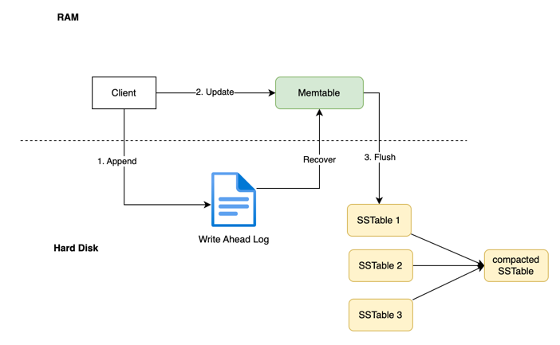
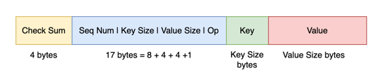
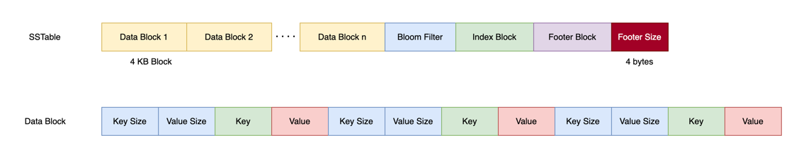
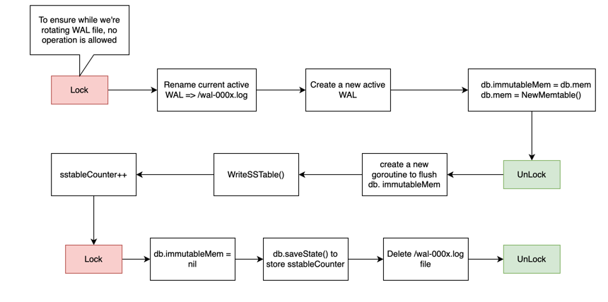

# Go-LevelDB - A [LevelDB](https://github.com/google/leveldb)-Inspired Key-Value Store

Go-LevelDB is a on-disk key-value storage engine built from scratch in Go,
inspired by the design of Google's [LevelDB](https://github.com/google/leveldb) and the **Log-Structured Merge-Tree (LSM-Tree)** architecture.

## Core Features ✨
- [x] **Durable & Fast Writes**: All writes are first committed to a Write-Ahead Log (WAL) for durability, then placed 
in an in-memory Memtable for high-speed write performance.
- [x] **Sorted In-Memory Storage**: Uses a Skip List for the Memtable, keeping keys sorted at all times for efficient 
flushing and enabling range scans.
- [x] **Persistent, Immutable Storage**: Flushes full Memtables to immutable, sorted SSTable (.sst) files on disk
- [x] **Efficient Lookups**: SSTables are highly structured with block-based indexes and Bloom filters to minimize disk
reads, especially for non-existent keys.
- [x] **Automatic Compaction**: process to merge SSTables, reclaim space, and optimize read performance.
- [x] **Single-Process Safety**: Implements an exclusive file lock to prevent concurrent access from multiple processes, ensuring data integrity.
### Future works
- [ ] **MANIFEST file**: a central repository for metadata, providing a consistent view of the database's structure and state
- [ ] **Leveled Compaction**: Evolve the compaction strategy from our "universal" approach to LevelDB's leveled approach,
where files are organized into levels (L0, L1, L2...). This provides better scalability and more predictable performance by running smaller, more targeted compactions.


## Architecture Overview

### WAL entry format



### SSTable format



### Flush Memtable flow



### Write Path ✍️

When a key-value pair is written to the database, it follows a durable, high-speed path:

1. Assign Sequence Number: The operation is assigned the next global sequence number.

2. Append to WAL: The operation (including its sequence number) is appended to the Write-Ahead Log (WAL) on disk.

3. Insert into Memtable: After being secured in the WAL, the InternalKey and value are inserted into the Memtable (a skip list), 
which maintains sorted order in memory.

4. Acknowledge: The write is acknowledged to the client.
Since the WAL write is sequential and the Memtable is in RAM, this process is extremely fast.

### Read Path 📖
To find a key, the database follows a specific lookup path to guarantee the most recent version is found:
1. **Check Memtable**: The active (writable) Memtable is checked first.
2. **Check Immutable Memtable**: If a flush is in progress, the read-only Immutable Memtable is checked next.
3. **Check SSTables**: If the key is not found in memory, the on-disk SSTable files are checked, from newest to oldest.
This process is highly optimized:
- A **Bloom Filter** is checked first. If it indicates the key is not in a file, the file is skipped entirely.
- If the key might be present, the file's Index Block is used to quickly find the specific Data Block that could contain
the key. Index Block is a list of IndexEntry, each IndexEntry stores the last key of a data block and its location in
SSTable file
```go
type IndexEntry struct {
	LastKey InternalKey
	Offset  int64
	Size    int
}
```
- Only then is that single Data Block read from disk to find the key.
### Compaction Path 🧹
Compaction is the background process that cleans up and optimizes the on-disk storage. It reduces the number of SSTable
files (improving read performance) and reclaims space from old, overwritten, or deleted data.
1. **Trigger**: A compaction is automatically scheduled when the number of active SSTable files exceeds a threshold (e.g., 4). 
This check is performed immediately after a flush is initiated.
2. **Input Selection**: A background goroutine starts and selects all currently active SSTable files as its input for the merge.
3. **K-Way Merge**: The process performs a memory-efficient merge of all input SSTables using a **min-heap**
4. **De-duplication**: As the merge proceeds, it keeps only the newest version of each key.
Because the heap is sorted by user key and then by descending sequence number, the first time a user key is encountered,
it is guaranteed to be the newest version. All subsequent older versions are discarded.
5. **Crash-Safe Output**: The clean, merged data is written to a new SSTable with a unique, higher file number.
Writing to a temporary file ensures that if the system crashes during this slow process, the original files are unharmed.
6. **Garbage Collection**: After the state is safely committed, a new goroutine is launched to delete the old, now-obsolete SSTable files.
## How to Run
1. Run the main program
```bash
go run .
```

## Project Structure
```bash
/
├── go.mod
├── main.go           # Example usage demonstrating core features
├── db.go             # Main DB struct, orchestrates all components
├── internal_key.go   # Defines the InternalKey and its custom comparator
├── wal.go            # Write-Ahead Log implementation for durability
├── memtable.go       # In-memory skip list-based data store
├── sstable.go        # SSTable writing and reading with indexing and filters
```